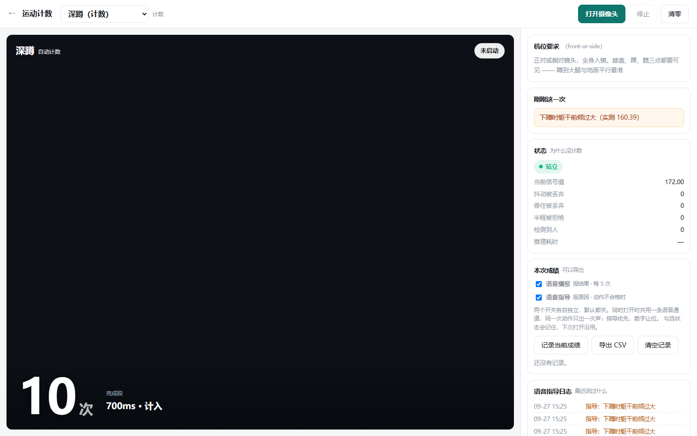
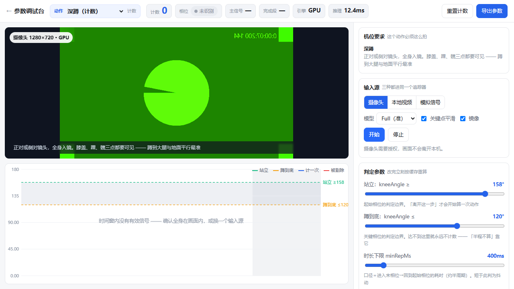
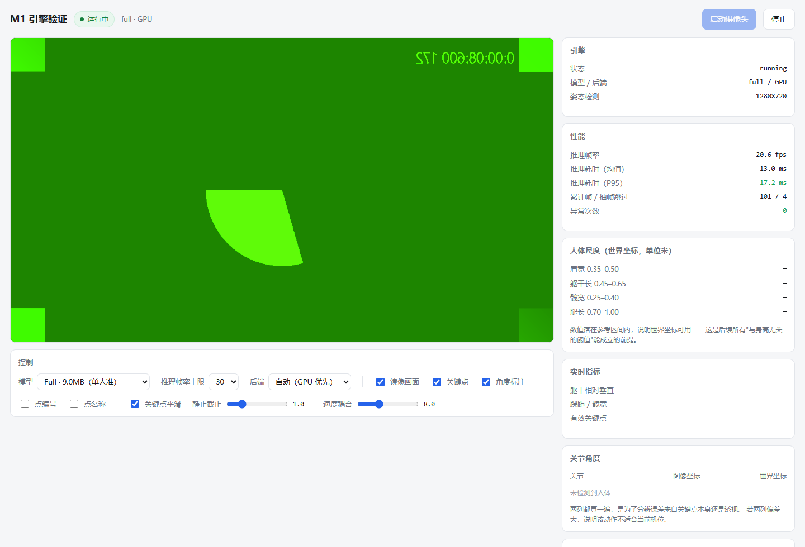

# 运动姿态识别应用（sports-pose-coach）

浏览器 + 摄像头实时识别运动动作，全本机运行，视频不出设备。

> 规划与评审记录见 [PLAN.md](PLAN.md)。
> 当前进度：**M1 引擎 ✅ / M2 调试台 ✅ / M2.5 参数存档 ✅ / M3 七个动作 + 上课用计数页 ✅ / M3.1 语音指导 ✅**

## 预览

| 上课用的计数页 `v1-counter.html` | 调参调试台 `tools/tune.html` | 引擎验证 `m1-engine-check.html` |
|---|---|---|
|  |  |  |

> 截图取自自检脚本的**合成摄像头**画面（画面里故意没有人 —— 正好也证明"无人时不误计数"）。
> 复现：`node tools/counter-test.js --port 4322 --shot shot.png`（`--shot` 三个自检都支持）。

---

## 怎么用

**双击 `启动.bat`** —— 它会自动起本地服务并打开浏览器。关掉那个黑窗口即停止。

首屏是统一入口页：

| 页面 | 用途 |
|---|---|
| `index.html` | 入口，列出各页与开发进度 |
| **`v1-counter.html`** | **上课用：动作计数 / 计时。老师日常就开这一页** |
| `m1-engine-check.html` | 引擎验证：确认摄像头与关键点质量。**第一次使用先看这页** |
| `tools/tune.html` | 参数调试台：调计数标准、看信号曲线。**调好的参数会自动保存** |

> **为什么不能直接双击 HTML？**
> 两条硬限制：MediaPipe 的 WASM 走 fetch 加载，`file://` 会被 CORS 拦死；
> 摄像头 `getUserMedia` 需要安全上下文，`file://` 下 Chrome 直接拒绝。
> 本地 `http://127.0.0.1` 同时满足这两条，因此必须走服务。

如果 4322 端口被占用，服务会自动往后找（最多试到 4345），启动窗口里有实际地址。

**双击后窗口一闪而过 / 报错**：脚本会停在窗口里并打印原因（缺 Node、`tools\serve.js` 不在等），
按提示处理后重试即可，不会静默失败。

### 从本仓库克隆后怎么搭起来

仓库里**只有本项目自己的源码**，不含第三方运行时与模型（那是 26 MB 的第三方分发物）。
三步即可：

```bash
git clone https://github.com/p4nt1um/sports-pose-coach
cd sports-pose-coach

node tools/fetch-vendor.js   # ① 拉 MediaPipe 运行时 + 模型到 vendor/（约 26 MB，按 sha256 校验）
                             #    没有这一步页面会白屏 —— 它找不到 wasm 和 .task 模型

node tools/serve.js          # ② 起本地服务，浏览器打开提示里的地址
                             #    或直接双击 启动.bat

npm install                  # ③ 仅当要跑浏览器自检时需要（装 playwright-core）
                             #    若本机还没有 Chromium：npx playwright install chromium
```

> ①② 是**运行**应用的最小步骤；③ 只在**跑自检**时需要。
> 四个 `tools/test-*.mjs` 不需要 npm，也不需要浏览器，装上 Node 就能跑。

`vendor/` 已被 `.gitignore` 排除，远端永远只有源码；`node tools/fetch-vendor.js` 可重复执行，
它会重新扫描目录并把实际文件的 sha256 写进 `vendor/VERSION.json`。

---

## M2：参数调试台（对着真人调计数标准）

打开 `tools/tune.html`。「怎么算一次深蹲」由阈值决定，**这些阈值不该由我猜，该由体育组定**。

**界面怎么读：**

- **左侧视频**：骨架叠加，膝盖处直接标出左右膝角
- **左侧曲线**：横轴时间，竖轴膝角。三条关键视觉元素：
  - 绿色虚线＝站立阈值（膝角高于它才算站直）
  - 橙色虚线＝下蹲阈值（低于它才算蹲到位）
  - 两条线之间的**灰色带＝死区（迟滞带）**：信号在死区里来回时状态机不动，这就是「腿抖不会乱计数」的原因
  - 背景色带＝当前相位（绿＝站立、橙＝蹲到底、灰＝未识别）
  - 竖线＝这里算了一次；红色虚线＝这里做了动作但被剔除
- **右侧面板**：拖动任一滑块，**立刻按已缓存的信号重算**，不必重做动作

**三种输入源**：摄像头 / 本地视频（可反复重放，调参最方便）/ 模拟信号（不接摄像头也能看界面该怎么表现）。

**调完不用管，自动就存了**：改动任一滑块后 400ms 自动保存，下次打开自动载入。
参数卡下方会显示「已保存 N 项调整」，并逐项列出**你把它从多少改成了多少**。

**要让改动对所有人生效**（而不只是本机），用「导出配置」把完整配置回填 `data/exercises.json`。

**"做了动作但没计数"怎么看**：看右侧「诊断」卡 —— 抖动被丢弃、停住被丢弃、半程被拒绝、低置信帧数。
计数不是靠调大调小"凑"出来的，每个被剔除的动作都有原因。

### 参数存档：存什么、怎么共享

老师调好的阈值是本机资产，不该每次重调。规则如下：

| 事项 | 行为 |
|---|---|
| 存在哪 | 浏览器本机存储（`localStorage`，键 `spc.tuned.<动作id>`）。不上传、不出设备 |
| 存什么 | **只存与文件默认值不同的项**（例：只有「下蹲阈值 100→124」），不是整份配置 |
| 为什么存差异 | 以后更新 `exercises.json` 的默认值时，你没动过的项会自动跟随新默认值。存全量会把你的配置永久冻结在当时的默认值上 |
| 什么时候存 | 改完滑块 400ms 自动存；填完立刻关页面也不会丢 |
| 「恢复默认」 | 连同存档一起清空 —— 不会出现"恢复了默认却还存着旧调整" |
| 换电脑 / 给同事 | 「备份存档」下载 `squat.tuned.json`，「载入存档」读回。也可直接导入一份完整动作配置 |
| 文件默认值后来变过 | 界面列出冲突项（文件里现在是 X、你调的是 Y），**仍按你调的值运行**，不会静默覆盖 |
| 浏览器禁用本地存储 | 状态条变红并说明「本次调整刷新后会丢」，不会假装存好了 |
| 存档损坏 | 当作没有存档处理并回落默认值，页面照常打开 |

> 存档模块是 `shared/tpc-store.js`，**M3 的计数页必须复用它读同一份存档**。
> 老师是在调试台调的参，真正计数时用的是另一个页面 —— 若各存各的，这个功能就等于只做了一半。

### 两个必须知道的口径

1. **`minRepMs / maxRepMs` 量的是「进入下蹲相 → 回到站立相」**（对深蹲约等于半周期），
   不是完整周期。状态机只观测得到阈值穿越，死区内的穿越它看不见。
   调试台会把实测值显示出来（顶部「完成段」），照着调即可。
2. **`guards` 写的是「应该成立的条件」**。例 `kneeAngle gt 70` 表示"膝角应大于 70"，
   真蹲到 65° 会打标记。写反会得到相反语义。

### 一个已知局限（不装作解决了）

**"坐椅子站起来"与深蹲在单一膝角信号下几乎不可分。** 这不是阈值能解决的问题，
所以不做假分辨：底部停留超过阈值就打标记（"在「蹲到底」停留过久（是否坐着完成？）"），由人判断。

---

## 上课用：动作计数页（`v1-counter.html`）

老师日常开的就是这一页。选动作 → 打开摄像头 → 学生做，数字自己走。

**界面分四块：**

- **中间大号读数**：计数动作显示「N 次」，计时动作显示「N.N 秒」。
  高抬腿这类左右交替的动作，下方另有一行**分腿计数**（左腿 / 右腿各多少）。
- **机位要求**：每个动作的机位提示不同，取自 `data/exercises.json`。**俯卧撑、仰卧起坐、
  靠墙静蹲必须侧面拍**，正面拍识别不了 —— 这是物理限制，不是调参能解决的。
- **「刚刚这一次」**：这次算没算、为什么没算，一句话说清（太快像抖动 / 只看到半个动作 /
  下蹲时躯干前倾过大…）。
- **「状态」卡**：回答**"为什么没计数"**。当前相位、当前信号值、抖动被丢弃数、
  停住被丢弃数、半程被拒绝数、是否检测到人、推理耗时。计时动作还会逐条列出
  保持条件（✓ 成立 / ✗ 不成立）。计数不是靠"凑"出来的，每一次被剔除都有原因。

**成绩记录与导出**：点「记录当前成绩」把当前读数写进本机列表（时间 / 动作 / 成绩），
可导出 CSV（带 UTF-8 BOM，Excel 直接打开不乱码；计数记「次」、计时记「秒」分列存放）。

### 两个语音开关：一个报结果，一个报原因

「本次成绩」卡里有两个独立复选框，**默认都是关的**，勾过之后会记住（`spc.voice.v1`），
下次打开沿用，不必每节课重勾。

| 开关 | 说什么 | 什么时候说 |
|---|---|---|
| **语音播报** | 报**结果** | 每 5 次报一个数字；计时段结束报「完成 N 秒」 |
| **语音指导** | 报**原因** | 动作被判定不合格时，一句话说清错在哪 |

**怎么判断"不合格"** —— 两条路径都覆盖，少一条就会漏掉最常见的场景：

1. **计数被拒**（`too_fast` 太快像抖动 / `too_slow` 停太久 / `partial` 只做了一半）。
   这一类**数字根本不涨**，学生最想知道的就是为什么。念的话是「太快了，不算」这类短句。
2. **计数通过但打了规范标记**（`guards` 或相位停留过久）。念的是标记本身，
   且会自动去掉给眼睛看的括号补充：「手臂未举过头顶（开合跳要求双手上举）」→「手臂未举过头顶」。
   一次踩几条只念**最主要**的一条：`severity: warn` 优先于 `info`，同级看持续帧数。

计时类（马步 / 靠墙静蹲）没有"计数被拒"这个概念，只报**确实能分辨**的两种：
段没到最短有效时长（念「时间太短，不算」），或段内条件断过 ≥2 次（念「没保持住，膝角在…」）。
**正常站起来结束一段不念** —— 学生主动收势和姿势散掉在数据上是同一件事，
分不清就不猜（同「坐椅子站起来 vs 深蹲」的处理立场）。

**两个开关同时打开会冲突吗** —— 不会，两处都有明确机制：

- **不重复**：同一次动作只要有不合格原因要说，就**不报数字**（判据用"该不该说"，
  而不是"有没有说出去"，否则指导处在冷却期时数字会漏出来，变成时有时无）。
- **不互相掐**：两个功能共用一条串行语音通道（`shared/tpc-guide.js` 的 `GuideSpeaker`）。
  各自调 `speechSynthesis.cancel()` 的话，后说的会把先说的掐断，两句话都只剩半截。
  撞车时**指导抢占计数**：纠正晚一秒就过期，数字下一轮还会再报。
- **不碎碎念**：同一句原因 5 秒内只念一次（不同原因各有各的额度，互不遮挡）；
  待播槽只留一条，新消息直接替换旧的（纠正讲的是"此刻"，过期就该丢）。

右下角另有一张**「语音指导日志」**卡。语音说完就没了，老师站在场地另一头，
事后无从复盘 —— 留一张表就能对着看系统到底报了什么。

> 想让某个提醒换种说法，在 `data/exercises.json` 的 `guard` / `conditions` 项上加
> `"speak": "手抬高"` 即可；想让它彻底静音，写 `"speak": false`。都不需要改代码。

### 七个动作与机位

| 动作 | 类型 | 机位 | 计数 / 计时口径 |
|---|---|---|---|
| 深蹲 | 计数 | 正面或侧面，全身 | 下蹲膝角 ≤100°、站起 ≥158° 才算一轮 |
| 开合跳 | 计数 | **正面**（侧对会让肩宽失真） | 踝距 ≤0.8×肩宽 ↔ ≥1.25×肩宽 |
| 俯卧撑 | 计数 | **侧面**，镜头压低到与身体同高 | 肘角 ≤105° 触底、≥150° 撑起 |
| 仰卧起坐 | 计数 | **侧面**，镜头压低到地面附近 | 躯干与垂直轴 ≥68° 躺平、≤45° 坐起 |
| 原地高抬腿 | 计数 | **正面**，两条腿都要可见 | 膝高过髋算一次；左右腿各一条信号、各自计数后合计 |
| 马步 | 计时 | 正面或侧面，全身 | 膝角 78°–132° 且躯干直立 ≤28°，条件成立才累加时长 |
| 靠墙静蹲 | 计时 | **侧面**，墙面最好入镜 | 膝角 82°–125° 且躯干 ≤20°（贴墙姿态） |

> **靠墙静蹲的诚实说明**：程序只能验证「膝角达标 + 躯干贴直」，**是否真的贴着墙它验不了**
> （需要墙的检测，属独立工作项）。所以机位提示里请把墙面拍进画面，由人确认。
> 这不是偷懒，是不假装能判断看不见的东西。

### 参数从哪来：与调试台共用同一份存档

这是最要紧的一条接线：**老师在调试台调好的阈值，这一页直接生效**。

- 两页共用一个键空间 `spc.tuned.<动作id>`，各自独立（`spc.tuned.squat`、`spc.tuned.horse_stance`…）
- 页面右下「参数」卡会写明：**已套用 N 项调试台自定义参数（X 月 X 日保存）**，
  或「使用 data/exercises.json 里的默认参数」。老师一眼能确认"现在用的是不是我调的那套"
- 底部有「去参数调试台调整 →」的直达链接

> ⚠ 修过的坑：`tpc-store.js` 的 `flattenParams` 当初只展开 `signals` 与 `fsm` 两棵子树，
> 而**计时动作根本没有 `fsm`** —— 阈值全在 `hold` 段里。后果是「在调试台把马步调了半天，
> 存档里一项都没有；刷新后全没了，且不报错」。这类故障是**静默**的，
> 现在 node 与浏览器两侧各留了防复发断言。

---

## M1 页面能做什么

这一页只验证底层引擎，不做动作识别。用途是确认"关键点准不准"这件事：

| 能力 | 说明 |
|---|---|
| 骨架叠加 | 逐段按关键点可信度着色：青=可信、黄=勉强、红=不可信 |
| 点编号 / 点名称 | 勾选后可逐点核对索引，排查"左右弄反"这类问题 |
| 双坐标系角度 | 图像坐标与世界坐标各算一遍。两列差异大 → 该动作不适合当前机位 |
| 人体尺度实测 | 直接读出肩宽 / 躯干长 / 髋宽的真实米数，验证世界坐标是否可用 |
| 性能面板 | 推理帧率、耗时均值与 P95、抽帧跳过数、异常次数 |
| 坐标原始值 | 展开可看 11 个关键点的图像/世界坐标与可见度，核对轴向 |
| 平滑参数 | 实时调节 One Euro 滤波的静止截止与速度耦合 |

**验收要点**：站在画面里，人体尺度应落在参考区间内（肩宽 0.35–0.50m、躯干长 0.45–0.65m）。
数字不对或骨架乱飘，说明摄像头或环境有问题，先解决这个再往下做。

---

## 目录

```
启动.bat              一键启动
index.html            统一入口
v1-counter.html       上课用：动作计数 / 计时（老师日常就开这一页）
m1-engine-check.html  M1 引擎验证页
PLAN.md               整体规划与评审记录（含 10 项评审决策与每轮实施说明）
README.md             本文件
.gitignore            排除 vendor / node_modules / 缓存 / .env / 自检截图
package.json          仅声明 devDependencies 与自检快捷脚本（运行应用不需要它）

docs/
  screenshots/        README 用的三张截图（由自检脚本 --shot 生成）

tools/
  serve.js            本地服务器（零依赖）
  serve.py            Python 后备服务器
  fetch-vendor.js     拉取 MediaPipe 运行时与模型
  pw.js               浏览器自检的公共引导（自动探测 playwright 与 Chromium）
  smoke-test.js       M1 自检：引擎链路 14 项
  tune.html           参数调试台
  tune-test.js        调试台自检 75 项（模拟信号 + 摄像头 + 存档 + 多动作 + 首页）
  counter-test.js     计数页自检 84 项（七动作 + 计时 + 存档复用 + 记录导出 + 离线护栏 + 语音）
  test-fsm.mjs        计数状态机回归（node 直跑，30 项）
  test-counter.mjs    七个动作的计数/计时回归（node 直跑，43 项）
  test-store.mjs      参数存档回归（node 直跑，54 项）
  test-guide.mjs      语音指导回归（node 直跑，38 项）
  write-bat.js        生成 启动.bat（CRLF 由代码构造，避免转义层数出错）
  inspect-bat.js      诊断/修复 .bat 换行字节异常（含 --selftest）
  test-bat.js         实测 启动.bat 能否真正拉起服务

shared/
  offline-guard.js    **普通脚本**，须在 head 最先加载：拦住境外遥测（见「已知约束」）
  tpc-core.js         引擎封装：加载、推理循环、GPU回落、统计
  tpc-math.js         几何与运动学：角度、距离、人体尺度归一化
  tpc-filter.js       One Euro Filter
  tpc-landmarks.js    33 关键点定义、骨架表、关节点组
  tpc-draw.js         骨架叠加绘制
  tpc-signals.js      特征层：关键点 → 一维信号（数据驱动）
  tpc-fsm.js          通用计数状态机
  tpc-hold.js         保持类计时器（马步 / 靠墙静蹲）
  tpc-counter.js      计数/计时统一门面 + 多通道（左右腿各跑一个状态机）
  tpc-guide.js        语音指导：判定→一句人话 + 串行播报队列（去重 / 抢话）
  tpc-store.js        参数存档：存差异 + 冲突检测 + 存储降级
  package.json        仅用于让 node 把本目录当 ES Module（浏览器忽略）

data/
  exercises.json      7 个动作的全部参数：信号/相位/阈值/时限/告警/机位/文案

vendor/               26.14MB，全离线运行所需 —— **不入库（第三方分发物）**
  mediapipe/          MediaPipe 运行时（vision_bundle.mjs + SIMD wasm）
  models/             pose_landmarker_lite.task / full.task
  VERSION.json        版本与文件校验清单（sha256）
                     用 `node tools/fetch-vendor.js` 恢复，见「从本仓库克隆后怎么搭起来」
```

---

## 架构（为什么这么分层）

```
摄像头/视频 ──► tpc-core ──► tpc-signals ──► tpc-counter ──► tpc-guide ──► 界面/语音
              只拿关键点     关键点→一维信号   ┌ tpc-fsm    计数   判定→一句人话
                                              └ tpc-hold   计时
```

**信号层与追踪层都不认识关键点索引。** 这不是洁癖，是为了两件事：

1. **所有动作共用一套状态机代码**，阈值、相位、时间约束全部写在 `data/exercises.json`。
   新增动作 = 加一段 JSON。M3 加 6 个动作时**没有为任何单个动作写过代码** ——
   只补了两类通用能力：多通道计数（左右腿）与保持类计时器。
2. **计数可以被单元测试**。状态机只吃一维数值，于是"深蹲 30 次""静立 60 秒""走动 30 秒"
   这些验收场景可以合成为信号曲线直接跑，不需要摄像头、模型、真人，结果可重复。
   这也是为什么 `test-fsm.mjs`（30 项）与 `test-counter.mjs`（43 项）能在几秒内跑完。

`tpc-guide.js` 是顺着同一条线加的第三层：它**只吃 `lastRep` / `checks` / `session` 这些纯数据**，
不认识关键点、不认识 DOM —— 于是"什么时候该说话、说什么、要不要让位给另一条语音"
这些最容易出静默故障的逻辑，可以在 node 里精确断言（`test-guide.mjs`，38 项），
不必靠"打开页面听一下"。

**多通道为什么是必需的（不是优化）**：原地高抬腿是左右交替。若把两腿膝高合成一个
「取大值」信号，一条腿落地时另一条已经抬起，合成值始终停在阈值之上、**永不回落**，
一整轮只穿越一次 → 严重漏计。`test-counter.mjs` 里留了对照实验：
**同样 20 次动作，单信号只数到 0 次，双通道 20 次。**

---

## 开发命令

```bash
# 起本地服务（--no-open 不自动开浏览器）
node tools/serve.js --port 4322
node tools/serve.js --port 4322 --no-open

# 拉取 / 更新 MediaPipe 运行时与模型
node tools/fetch-vendor.js
node tools/fetch-vendor.js --with-nosimd   # 需要兼容 2021 年前的老浏览器时

# 计数状态机回归（不需要摄像头/模型，秒级）
node tools/test-fsm.mjs
node tools/test-fsm.mjs --verbose

# 七个动作的计数/计时回归（同样不需要摄像头，秒级）
node tools/test-counter.mjs

# 参数存档回归（同样不需要浏览器，覆盖冲突检测与存储降级）
node tools/test-store.mjs

# 语音指导回归（不需要浏览器：文案翻译 / 挑主要原因 / 去重 / 抢话）
node tools/test-guide.mjs

# 浏览器自检：引擎链路 14 项
node tools/smoke-test.js --port 4322
node tools/smoke-test.js --port 4322 --shot shot.png

# 浏览器自检：调试台 75 项（模拟信号 + 摄像头 + 存档 + 多动作 + 首页入口）
node tools/tune-test.js --port 4322
node tools/tune-test.js --port 4400 --shot tune.png

# 浏览器自检：计数页 84 项（七动作 + 计时 + 存档复用 + 记录导出 + 离线护栏 + 语音指导）
node tools/counter-test.js --port 4322
node tools/counter-test.js --port 4400 --shot counter.png

# 启动器维护（改启动逻辑时用）
node tools/write-bat.js                  # 重新生成 启动.bat
node tools/inspect-bat.js                # 体检：换行字节 / 编码 / BOM
node tools/inspect-bat.js --selftest     # 自测修复逻辑不会破坏路径
node tools/test-bat.js                   # 真实跑一次 bat，验证服务被拉起
```

等价的 npm 快捷方式（`package.json`，仅自检用得上）：

```bash
npm run serve          # = node tools/serve.js --port 4322
npm run vendor         # = node tools/fetch-vendor.js
npm run test:node      # 四个 node 直跑回归，无需浏览器、无需 npm install
npm run test:smoke     # 引擎链路 14 项（需先起服务）
npm run test:tune      # 调试台 75 项（需先起服务）
npm run test:ui        # 计数页 84 项（需先起服务）
```

**改动核心层或状态机后，请至少跑 `test-fsm.mjs` + `test-counter.mjs` + `smoke-test.js`。**
改参数只改 `data/exercises.json`，改完务必用 `tune.html` 对着真人或视频验证，再跑一遍回归。

> **自检必须先起服务**：`smoke-test.js` / `tune-test.js` / `counter-test.js` 只是浏览器客户端，
> 需要另开一个窗口跑 `node tools/serve.js --port 4400 --no-open`。

> **浏览器从哪来**：`tools/pw.js` 会自动找 playwright 与本机 Chromium（本机缓存 →
> `node_modules` → 全局），**代码里不写死任何绝对路径**，换台机器不用改代码。
> 需要指定时用环境变量：`PW_MODULE=<playwright-core 目录>`、`PW_CHROME=<chrome 可执行文件>`。
> 找不到时会打印三行安装提示（`npm install` + `npx playwright install chromium`）。

> **`启动.bat` 的铁律：不要用编辑器直接改它，改 `tools/write-bat.js` 里的行数组再重新生成。**
> `.bat` 对换行字节极敏感，也必须是纯 ASCII、不带 BOM。一旦被写成
> 「一行里塞满字面量 `\r\n`」，cmd 会把整份脚本当一行解析并直接报错。
> `write-bat.js` 在写盘前会校验这三点；`inspect-bat.js` 可以体检任意 `.bat`。

---

## 已知约束

| 项 | 说明 |
|---|---|
| 浏览器 | 需要 SIMD 支持（Chrome/Edge 91+、Firefox 89+、Safari 16.4+）。已裁掉 nosimd 兼容版 |
| 摄像头 | 需要 1280×720 及以上。低于 640 宽会提示精度下降 |
| 机位 | 俯卧撑 / 仰卧起坐 / 靠墙静蹲**必须侧面拍**，正面识别不了 |
| 手机当摄像头 | 局域网 IP 不是安全上下文，需 https 或 Chrome flag 白名单。v1 不做手机适配 |
| 推理耗时 | Full 模型 720p 实测 13ms/帧；多人场景将切 lite 模型 |
| 单信号局限 | 深蹲的「坐椅子站起来」在单一膝角信号下与真实深蹲不可分。界面会打标记由人判断，不做假分辨 |
| **靠墙静蹲** | 程序只验「膝角达标 + 躯干贴直」，**验不了"背是不是真的贴着墙"**（需墙检测，属独立工作项）。请把墙面拍进画面由人确认 |
| **零外部请求（重要）** | MediaPipe 的运行时内置了使用统计上报器（`new Fh(apiKey)` → `POST https://odml.pa.googleapis.com/v1/log`），**库没有提供关闭开关**。它每 60 秒 flush 一次、`close()` 会强制 flush → 老师点「停止」时会发出去。上报内容与人体姿态无关（任务类型/耗时/设备信息/API key），但与本项目「视频不出本机、完全离线」的承诺冲突，因此 `shared/offline-guard.js` 在传输层把它拦住（只放行同源与 `blob:`/`data:`）。三个页面都已加载；自检断言「实际发出 0 条」+「确实拦到那条遥测」 |
| 参数存档 | 存在浏览器本机存储：**换浏览器、换电脑、清缓存都会丢**（所以有「备份存档」）。也不会自动同步到其它机器 |
| 语音开关存档 | 同上，键 `spc.voice.v1`。清缓存后会回到「两个都关」的默认态 |
| 语音指导的局限 | 只念**程序能分辨**的原因。计时类分不清「主动收势」与「姿势散掉」，这类不猜、不出声；连续做错时同一句 5 秒内只念一次（不是每次都念） |
| 仓库形态 | 只提交**本项目自己的源码**。`vendor/`（26 MB MediaPipe 运行时与模型，第三方分发物）与 `node_modules/` 不入库，克隆后 `node tools/fetch-vendor.js` 恢复；自检 `--shot` 产生的截图不入库，仓库只保留 `docs/screenshots/` 下精选的三张 |

> **自检的一个盲点（已修）**：浏览器自检过去只在「引擎运行中的几秒内」查外部请求，
> 而遥测是 60 秒才 flush 一次的 —— 所以长期显示「0 外部请求」却并不成立。
> 现在三个自检都改成**先停引擎再查**。

> **语音还有一个盲点（写自检时踩到）**：合成信号是**一次同步跑完几百帧**的，
> 而真实 TTS 播完一句要一两秒。不处理的话，喂帧期间第一句永远处于"正在播"，
> 后面的话全被压进待播槽（只留一条）→ 断言读到「一句话都没播」，其实是播了。
> 所以自检里先用 `__counter.setStubSpeech(true)` 把发声换成立刻回调的桩：
> 换掉的只是"什么时候算播完"，开关判断、去重、抢话全在真代码里跑。

---

## 下一步

**M4**：班级成绩表 + 历史趋势 + v1 验收报告。
单次成绩记录、CSV 导出、语音播报与语音指导已落地（见 `v1-counter.html`）。

**M5**：投篮六维评分 + 权重可调 + 雷达图 + 残影叠加 + 引体向上（需特定机位）。

> 高抬腿的口径按评审决策是「单腿计 1 次（左+右=2 次）」。
> 实现上**没有**用峰谷过零检测 —— 改成左右腿各一条信号、各跑一个独立状态机再合计，
> 更简单也更可解释，且快慢都稳（`minHoldFrames: 1` 专门为高频动作放开）。
